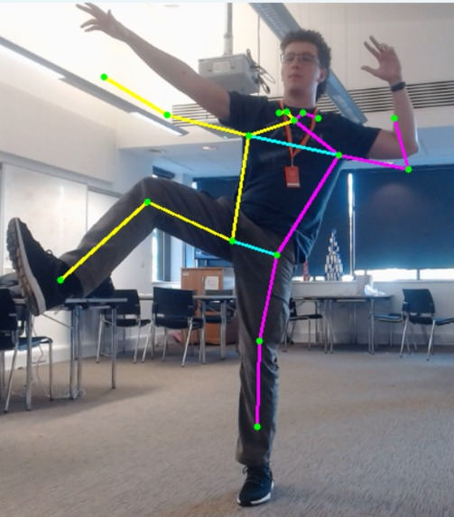
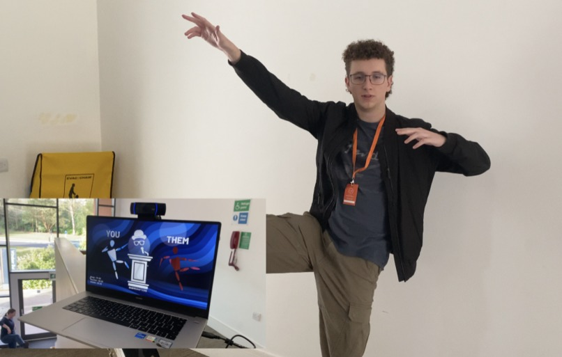

<!-- Improved compatibility of back to top link: See: https://github.com/pull/73 -->

<!-- PROJECT LOGO -->
 

  

  <h3 align="center">Shapeshifters</h3>

  

    🕺 3rd Place at RoyalHackaway v7! Networked Computer-Vision Hole in the Wall Game deployed using OpenCV2, Tensorflow, GMS2, Azure, Python3, Java & REST.
     
     
    <a href="https://devpost.com/software/shapeshifters">View Devpost</a>
    ·
    <a href="https://github.com//tobybenjaminclark/shapeshifters/issues">Report Bug</a>
    ·
    <a href="https://github.com/tobybenjaminclark/shapeshifters/issues">Request Feature</a>
  

<!-- ABOUT THE PROJECT -->
## About The Project
Shapeshifters is a mixed reality, online networked game similar to the TV Show [Hole in the wall](https://youtu.be/kOTLKQAHIPg?si=L509Vuv0bszSmlG7) - where players have to hold poses to fit through the wall. We wanted to promote stretching, and at home exercise in a sociable way without the need for specialist hardware, only WiFi and a webcam! You can think of it similarly to an online Wii/Kinect game.

  

We use a dedicated raw-UDP client to talk to the computer vision, from the game with a separate, azure-networked endpoint for storing game data. We also have a raw-TCP relay server to provide low latency multiplayer, which acts as a low latency proxy. We chose low-level data transmission to minimise latency and increase gameplay fluidity & responsiveness.

(<a href="#readme-top">back to top</a>)

<!-- USAGE EXAMPLES -->
## Gallery & Information
##### Computer Vision for Human Pose Estimation
Shapeshifters uses [MoveNet](https://www.tensorflow.org/hub/tutorials/movenet) to calculate human pose estimates from the webcam. MoveNet initially returns a list of positions on the body, however we decided to convert these to angles to ensure that people of different heights and dimensions are all portrayed similarly, see visualisation below.

  

<a href="https://www.linkedin.com/in/eden-h-7720b9280/">Eden</a> demonstrating the Human Pose Estimation

##### Game Client & Visualisation
Developed in [Gamemaker](https://gamemaker.io/en), the client communicates with the networked azure instance, and the locally hosted CV-client to get information about the current players pose, and the networked players pose. This is visualised as 2 players on the screen, captioned 'You' and 'Them".

  

##### Networking & Architecture
ngles retrieved from the computer vision server are sent to the GameMaker client over a raw (P)UDP. connection. A raw-TCP Relay connection was established between an Azure server and GameMaker clients to constantly transfer pose data across clients. This ensures you can see your opponent's live pose on the screen, at a low latency. Furthermore, a second TCP Server was established to transfer extra information about the game, such as game states, average-accuracies & score!

(<a href="#readme-top">back to top</a>)

<!-- CONTRIBUTING -->
## Contributing
Since the project was born out of a 24-hour hackathon, there are countless issues and bugs - note the lack of installation guidance here as an example. If, despite the complete lack of documentation, you wish to contribute to Shapeshifters, please feel free to create a feature branch or raise an issue! If you encounter any big issues, or get really stuck - feel free to contact whoever you think is most relevant to the issue you are encountering. 

1. Fork the Project
2. Create your Feature Branch (`git checkout -b feature/AmazingFeature`)
3. Commit your Changes (`git commit -m 'Add some AmazingFeature'`)
4. Push to the Branch (`git push origin feature/AmazingFeature`)
5. Open a Pull Request

> I'd really advise against trying to fix this repository particularly - to get this functional on the day involved using 2 laptops alongside a networked azure instance. If you are looking to create a game using HPE, feel free to take a look at snippets but **I would wholeheartedly advise against trying to fix this source code.**

(<a href="#readme-top">back to top</a>)

<!-- LICENSE -->
## License

Distributed under the MIT License. See `LICENSE.txt` for more information.

(<a href="#readme-top">back to top</a>)

<!-- CONTACT -->
## Contributors
[Amber Swarbrick](https://github.com/aswarbs) - Human Pose Estimation

[Eden Hamilton](https://github.com/EdenH1234) - Networking & Multiplayer

[Toby Clark](https://github.com/tobybenjaminclark) - Game Design & Interaction

(<a href="#readme-top">back to top</a>)

